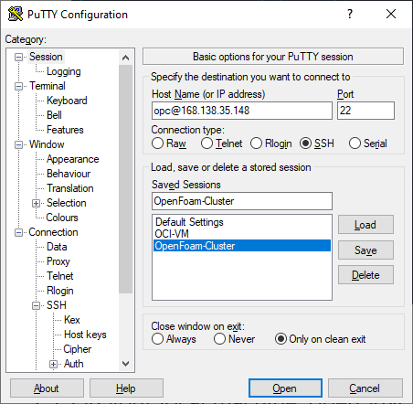
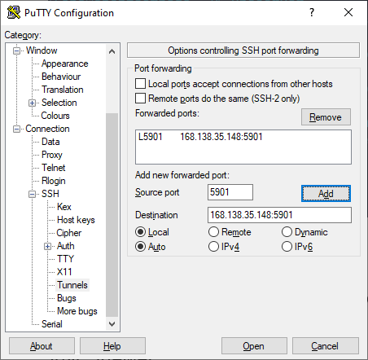

# OCI OpenFOAM Workshop
###### 
Total Time: 45-60 minutes

### Motorbike Simulation on Oracle Cloud Infrastructure (OCI)

	

### Summary
Deploy a stack that hosts a compute node that is configured for GUI interaction with a motorbike model in 3D virtual space.

Here is what gets installed on the compute node:
* VNCServer for providing GUI access to the remote machine
* a copy of a motorbike model that was assembled using OpenFOAM, a computational fluid dynamics software.
* ParaView for provising GUI access to the motorbike model

### Table of Contents

- [Phase 1](#phase-1-deployment): Deploy the stack using Resource Manager or Command Line
- [Phase 2](#phase-2-visualize-on-oci): Visualize the motorbike model on the compute node
- [Phase 3](#phase-3-deprovision-the-stack): Deprovision the stack using Resource Manager or Command Line

### Workshop Prerequisites
- Access to an OCI Tenancy (account)
- [VNC Viewer](https://www.realvnc.com/en/connect/download/viewer/) installed on your local machine as a client application for VNCServer.
- An SSH key pair on your local machine.
- Permissions to manage the following resources in some Compartment: Virtual Cloud Network, Subnet, Route Table, Security List, Internet Gateway, Compute Instance. (See [Identity and Access Management Policies](https://docs.oracle.com/en-us/iaas/data-safe/doc/iam-policies.html))
- Sufficient availability to provision 1 x each of the aformentioned resources. You can check resource availability:
<pre>
Hamburger Menu &gt Governance &gt Limits, Quotas and Usage
</pre>

	
Check resource availability

## Phase 1. Deployment

:clock3:
&nbsp;
30 or 40 minutes

You can deploy this compute node via Resource Manager or Command Line. Click into one of these methods to be directed to the section where you deploy the stack. You will be directed back to this page for Phase 2 when it is time to visualize the motorbike model.

* [Resource Manager](https://github.com/oci-hpc/oci-openfoam-workshop/blob/oci-hpc/Documentation/Resource%20Manager.md), a stack manager that is accessible as a GUI on the OCI portal

:clock3:
&nbsp;
30 minutes

* [Command Line](https://github.com/oci-hpc/oci-openfoam-workshop/blob/oci-hpc/Documentation/Command%20Line.md) using ocihpc, an HPC stack deployment tool for the CLI.

:clock3:
&nbsp;
40 minutes

## Phase 2. Visualize on OCI

:clock3:
&nbsp;
15 minutes

### Step 1. Connect to your remote host via VNC.

:clock3:
&nbsp;
5 minutes

1. Establish a port mapping from port 5901 on your local machine to port 5901 on the remote host. You can find the public IP address of your remote host after the deployment job has finished:

Via <b>CLI</b>: at the bottom of CLI output

or

Via <b>Resource Manager</b>: at the bottom of the logs on the Logs page or on the Outputs page

	
Unix-based OS

	

	1.1.Unix.1. Establish the port mapping using the following command:
	

	<pre>
	ssh -i <b>SSH_PRIVATE_KEY_PATH</b> -L 5901:localhost:5901 opc@<b>REMOTE_HOST_IP_ADDRESS</b>
	</pre>

	
Windows

	

	

		
1.1.Win.1. Establish the port mapping

		

		

	

	

	

		
1.1.Win.2. Encrypt the SSH tunnel

		

		

	

2. Execute the following command on your remote machine to launch a VNCServer instance on port 5901 on the remote host:

<pre>
vncserver
</pre>

	
Port mapping from localhost to remote host

3. On your local machine, open VNC Viewer.

4. Enter <b>localhost:5901</b> into the search bar and press return.

	
VNC Viewer

5. Enter the password <b>HPC_oci1</b> when prompted.

	
Enter VNC password

6. Click through the default options (<b>Next</b>, <b>Skip</b>) to get to the end with the VNC setup wizard:

<pre>
language options &gt keyboard layout options &gt location services options &gt connect online accounts options
</pre>

	
GUI desktop options - choose language

### Step 2.	Visualize the simulation using ParaView.

:clock3:
&nbsp;
5 minutes

<!-- 2.1. Open Terminal from your VNC Viewer window:

<pre>
click <b>Applications</b> &gt hover over <b>System Utilities</b> &gt click <b>Terminal</b>
</pre>

	
Navigate to Terminal on the remote host

 -->

1. Open Files from your VNC Viewer window:

<pre>
click <b>Applications</b> &gt hover over <b>Accessories</b> &gt click <b>Files</b> &gt on the left side of the window, click <b>Home</b>
</pre>

<!-- 2.2. Open Paraview by executing the following command from the Terminal instance in your VNC Viewer window:

<pre>
paraview
</pre>

	
Run ParaView on the remote host

 -->
	
2. Open ParaView:

<pre>
double-click <b>ParaView</b> &gt double-click <b>bin</b> &gt double-click <b>paraview</b>
</pre>
<!-- 2.3. In ParaView, open the motorbike.foam file:

<pre>
File > Open > choose <b>/mnt/volb/work/motorbike.foam</b>
</pre>

	
Open motorbike.foam in ParaView

 -->
3. In ParaView, open the motorbike.foam file:

<pre>
File > Open > choose <b>/home/opc/work/motorbike.foam</b>
</pre>

	
Open motorbike.foam in ParaView

4. Under the <b>Properties</b> pane on the left side of Paraview, select <b>Mesh Regions</b> to select everything, and then deselect the options that do not start with the string <b>motorBike_</b>. You can adjust the windows to make this section of the GUI easier to access e.g. by closing <b>PipeLine Browser</b> section by clicking <b>X</b>.

	
Before selection of <b>motorBike_</b> options

	

	

	
After selection of <b>motorBike_</b> options

5. Click the green <b>Apply</b> button to render the motorbike image. If a window with a list of errors appears, titled <b>Output Messages</b>, you may close it.

6. The motorbike model should appear in the large window titled <b>RenderView1</b>. Use your mouse and its left-click button to manipulate it in virtual 3D space!

	
Motorbike model

## Phase 3. Deprovision the stack

:clock3:
&nbsp;
5 minutes

Deprovision the stack with the same tool you used to deploy the stack:

	
Resource Manager

If you used Resource Manager to deploy the stack, continue to the [final step](https://github.com/oci-hpc/oci-openfoam-workshop/blob/oci-hpc/Documentation/Resource%20Manager.md) in the Resource Manager section.

	
Command Line

	
If you used Command Line to deploy the stack, continue to the [final step](https://github.com/oci-hpc/oci-openfoam-workshop/blob/oci-hpc/Documentation/Command%20Line.md) in the Command Line section.

