# oci-openfoam-workshop

### Motorbike Simulation on Oracle Cloud Infrastructure (OCI)

	

### Workshop Prerequisites
- Access to an OCI Tenancy (account)
- [VNC Viewer](https://www.realvnc.com/en/connect/download/viewer/) installed on your local machine as a client application for VNCServer.
- An SSH key pair on your local machine.
- Permissions to manage the following resources in some Compartment: Virtual Cloud Network, Subnet, Route Table, Security List, Internet Gateway, Compute Instance, Block Volume. (See [Identity and Access Management Policies](https://docs.oracle.com/en-us/iaas/data-safe/doc/iam-policies.html))
- Sufficient availability to provision 1 x each of the aformentioned resources. You can check resource availability:
<pre>
Hamburger Menu &gt Governance &gt Limits, Quotas and Usage
</pre>

	
Check resource availability

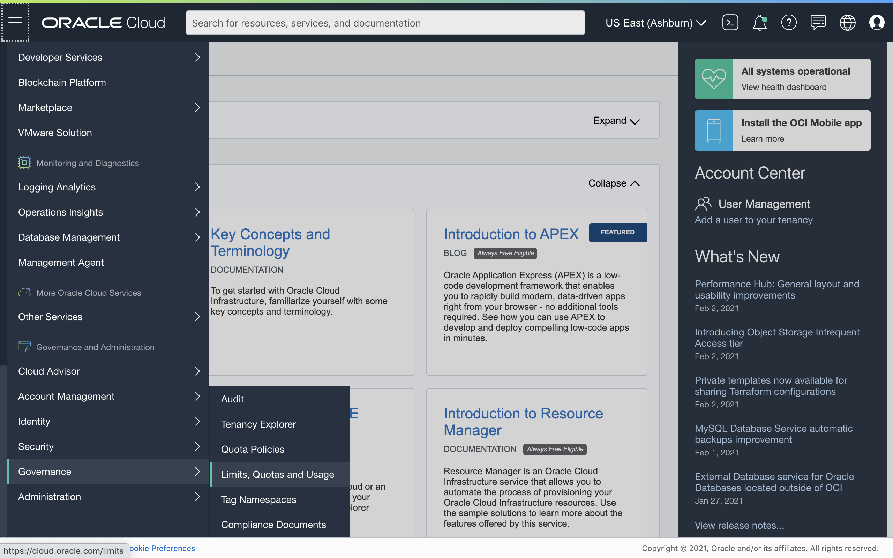

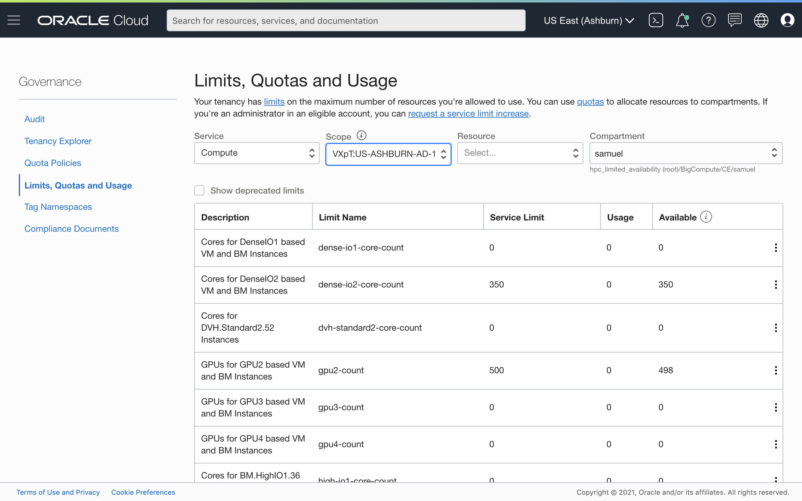

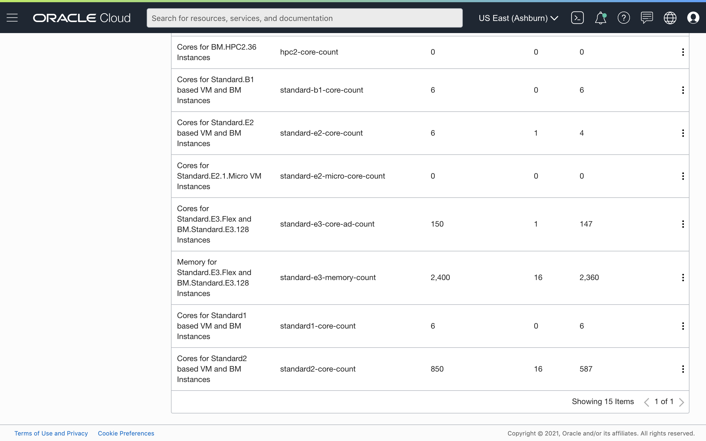

### Workshop Steps
###### 
Total Time: 1-2 hours

1. Launch a job via Resource Manager that provisions the infrastructure on OCI by deploying the <b>openfoam-workshop</b> project.\
	:clock3:
	&nbsp;
	~10 minutes
	

	1.1. Clone this project:
	

	<pre>
	git clone https://github.com/scacela/oci-openfoam-workshop
	</pre>
	

	1.2. Remove <b>oci-openfoam-workshop/pictures</b> and <b>oci-openfoam-workshop/.git</b> to eliminate excess data from the project, so that the project does not exceed the 11 MB size limit for uploading to Resource Manager: 
	

	<pre>
	cd oci-openfoam-workshop
	rm -r pictures
	rm -rf .git
	</pre>
	1.3. Open a web browser and navigate to the <b>Create Stack</b> wizard in Resource Manager, in your preferred Compartment and Region:
	

	<pre>
	cloud.oracle.com &gt sign into your OCI Tenancy &gt click Hamburger Menu &gt hover over <b>Resource Manager</b> &gt click <b>Stacks</b> &gt choose your Compartment from the dropdown menu under <b>List Scope</b> &gt click <b>Create Stack</b>
	</pre>
	

		
Navigate to the <b>Create Stack</b> wizard

	
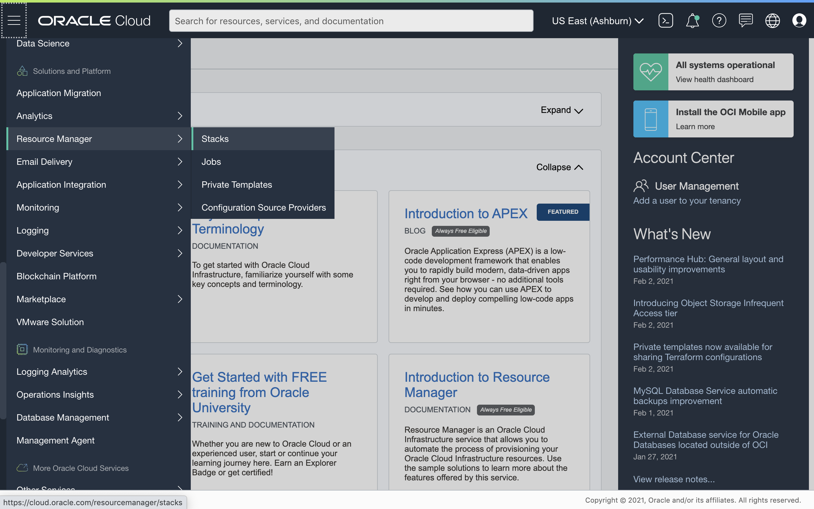
	

	

	
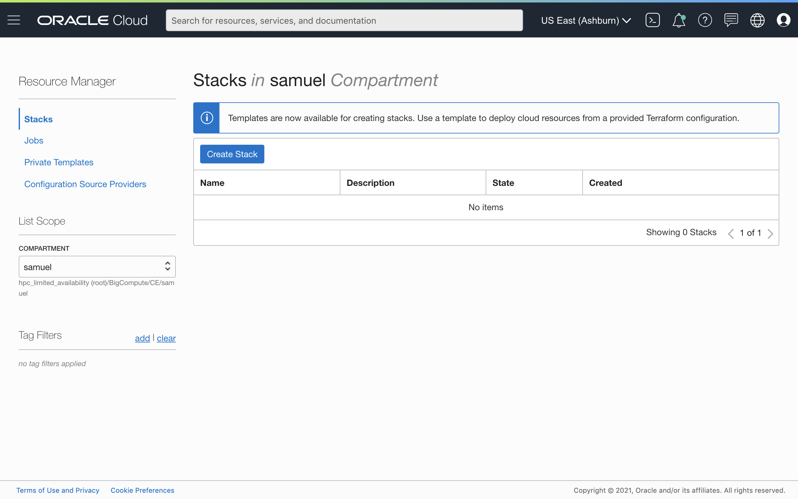
	

	

	

	

	

	</pre>
	1.4. In the <b>Stack Information</b> section of the <b>Create Stack</b> wizard, click <b>Browse</b> under <b>Stack Configuration</b> and choose the <b>openfoam-workshop</b> folder (or .zip file), then click <b>Next</b>.
	

		
Stack wizard - <b>Stack Information</b> section

	

	

	
or

	
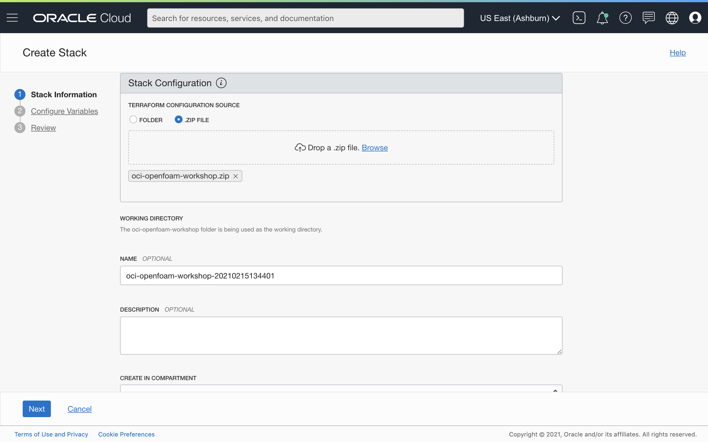
	

	

	1.5. In the <b>Configure Variables</b> section, do the following for the appropriate field:
	

	- Select a Compartment where you have permissions to manage the resources that are mentioned in the <a href="#workshop-prerequisites">Prerequisites</a> section.
	

	- Paste the contents of your SSH public key file.
	

	The default location of your SSH public key file on your machine is <b>~/.ssh/id_rsa.pub</b>. You can copy these contents to your clipboard from your Mac OS local machine by executing:
		

	<pre>
	pbcopy &lt ~/.ssh/id_rsa.pub
	# pbcopy &lt <b>PUBLIC_KEY_PATH</b>
	# then paste with CMD+V
	</pre>
	
or

	<pre>
	cat ~/.ssh/id_rsa.pub
	# cat <b>PUBLIC_KEY_PATH</b>
	# capture the output manually with CMD+C, then paste with CMD+V
	</pre>
		
You can generate a new key pair on Mac OS if necessary by executing:

	<pre>
	ssh-keygen
	</pre>
		on your Mac OS or Linux machine and specifying (1.) the path on your local machine where the key pair will be saved, and (2.) no passphrase for the key pair.
	

		
Copy contents of new SSH public key to clipboard

	

	

	

	- Select a shape for your Compute Instance.
	

	The name of the shape indicates the number of cores that are available to that shape, e.g. the VM.Standard2.<b>8</b> shape has <b>8</b> cores available.
	

	- Select the number representing the Availability Domain (AD) in which the infrastructure will be provisioned.
	

	Note that the availability of cores the shape that you use will vary between Availability Domains. The way to check resource availability is described in the <a href="#workshop-prerequisites">Prerequisites</a> section.
	When you are finished configuring your variables, click <b>Next</b>.
	

		
Stack wizard - <b>Configure Variables</b> section

	

	

	

	1.6. In the <b>Review</b> section, click <b>Create</b>.
	

		
Stack wizard - <b>Review</b> section

	
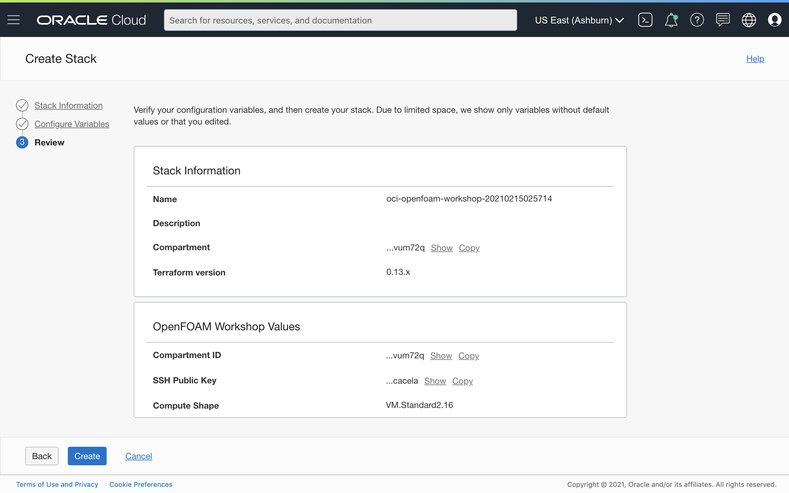
	

	

	1.7. On the <b>Stack Details</b> page, Under <b>Terraform Actions</b> dropdown menu, click <b>Apply</b> > <b>Apply</b> to provision the infrastructure.
	

		
Provision the infrastructure

	
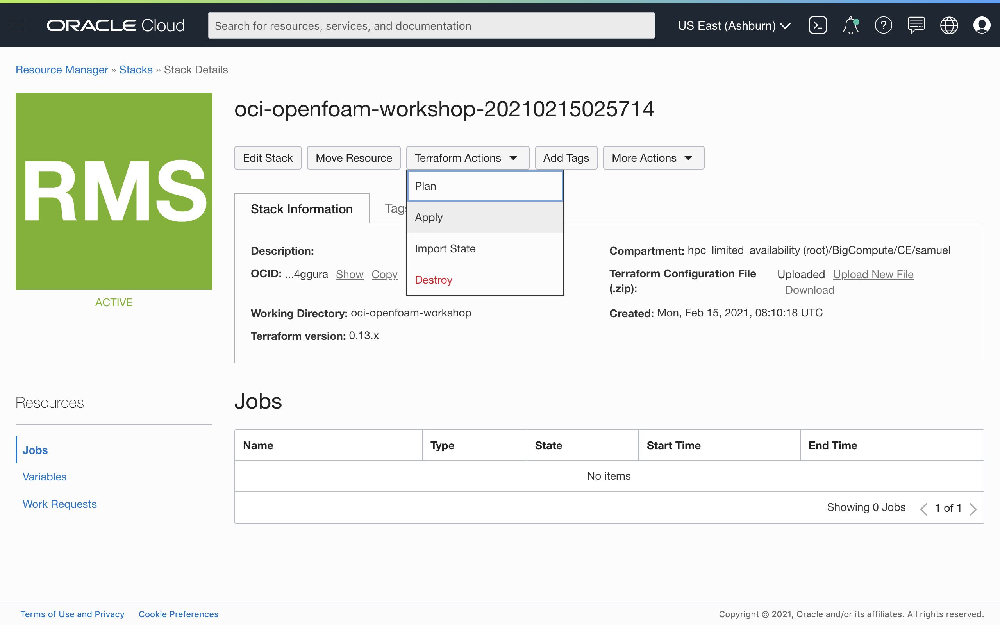
	

	

	
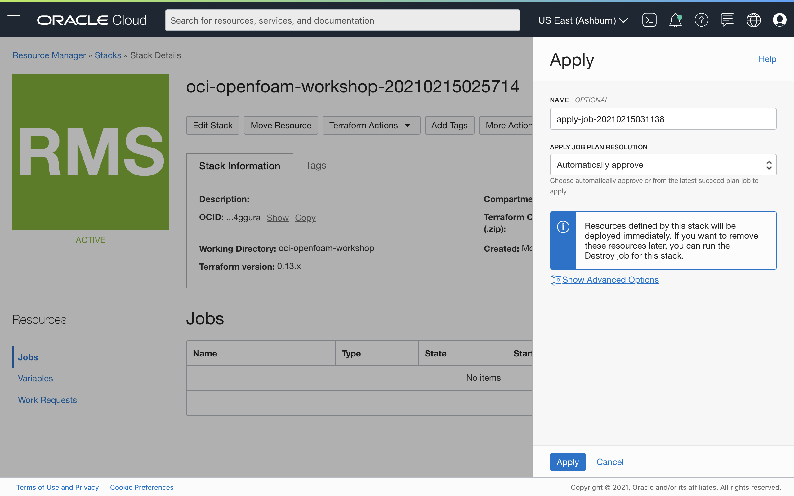

	

	

		
Resource Manager - <b>Apply</b> job in progress

	

	

	

2. Wait for the infrastructure to finish provisioning.
	From the left side of the page, you can monitor the logs of the Resource Manager job while the job is running, or check the variables, and after the Resource Manager job completes, you can obtain the output values.<!-- \
	:clock3:
	&nbsp;
	~45 minutes with BM.Standard2.52 shape\ -->\
	:clock3:
	&nbsp;
	~60 minutes with VM.Standard2.16 shape\
	:clock3:
	&nbsp;
	~75 minutes with VM.Standard2.8 shape
	

	

		
Resource Manager - Logs

	

	

	

	

		
Resource Manager - Variables

	

	

	

	

		
Resource Manager - <b>Apply</b> job complete

	
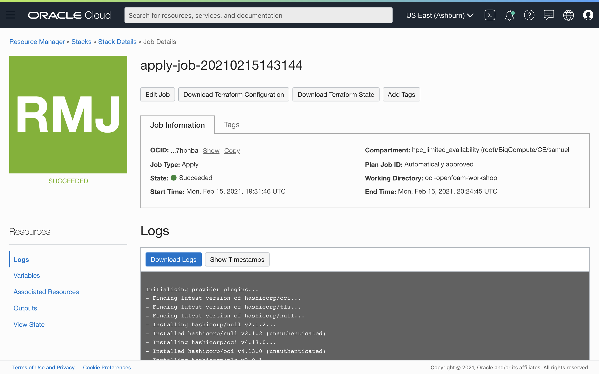
	

	

	

		
Resource Manager - Outputs

	

	

	

3.	Connect to your remote host via VNC.\
	:clock3:
	&nbsp;
	~5 minutes
	

	3.1. Establish a port mapping from port 5901 on your local machine to port 5901 on the remote host. You can find the public IP address of your remote host from the Outputs section on the left side of the screen after the Resource Manager job has completed.
	

	<pre>
	# if the private SSH key is in default location, ~/.ssh/id_rsa
	ssh -L 5901:localhost:5901 opc@<b>REMOTE_HOST_IP_ADDRESS</b>
	&nbsp;
	# if the private SSH key is in a different location, execute:
	ssh -i <b>SSH_PRIVATE_KEY_PATH</b> -L 5901:localhost:5901 opc@<b>REMOTE_HOST_IP_ADDRESS</b>
	</pre>
	

	3.2. Execute the following command on your remote machine to launch a VNCServer instance on port 5901 on the remote host:
	

	<pre>
	vncserver
	</pre>
	

		
Port mapping from localhost to remote host

	
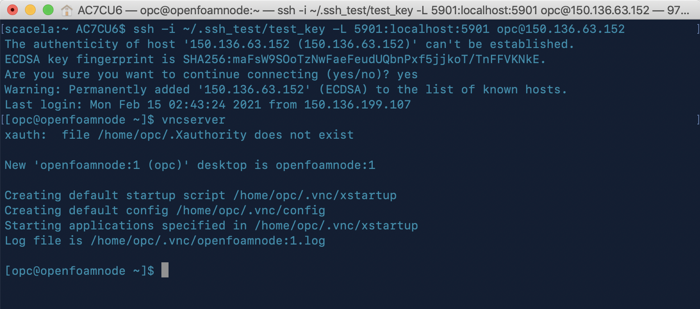
	

	

	3.2. On your local machine, open VNC Viewer.
	3.3. Enter <b>localhost:5901</b> into the search bar and press return.
	

		
VNC Viewer

	

	

	

	3.4. Enter the password <b>HPC_oci1</b> when prompted.
	

		
Enter VNC password

	

	

	

	3.5. Click through the default options (<b>Next</b>, <b>Skip</b>) to get to the end with the VNC setup wizard:
	

	<pre>
	language options &gt keyboard layout options &gt location services options &gt connect online accounts options
	</pre>
	

		
GUI desktop options - choose language

	

	

	

4.	Visualize the simulation using ParaView.\
	:clock3:
	&nbsp;
	~5 minutes
	

	4.1. Open Terminal from your VNC Viewer window:
	

	<pre>
	click <b>Applications</b> &gt hover over <b>System Utilities</b> &gt click <b>Terminal</b>
	</pre>
	

		
Navigate to Terminal on the remote host

	

	

	

	4.2. Open Paraview by executing the following command from the Terminal instance in your VNC Viewer window:
	

	<pre>
	paraview
	</pre>
	

		
Run ParaView on the remote host

	
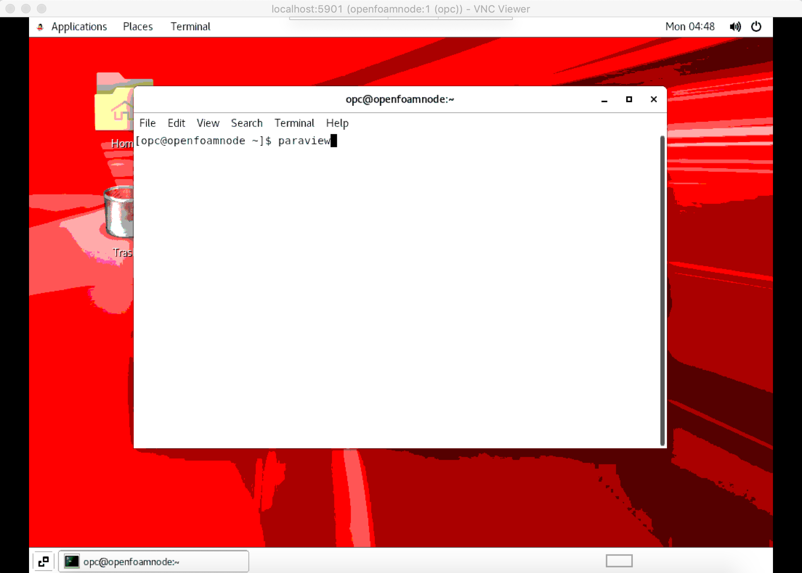
	

	

	4.3. In ParaView, open the motorbike.foam file:
	

	<pre>
	File > Open > choose <b>/mnt/volb/work/motorbike.foam</b>
	</pre>
	

		
Open motorbike.foam in ParaView

	

	

	

	4.4. Under the <b>Properties</b> pane on the left side of Paraview, select <b>Mesh Regions</b> to select everything, and then deselect the options that do not start with the string <b>motorBike_</b>. You can adjust the windows to make this section of the GUI easier to access e.g. by closing <b>PipeLine Browser</b> section by clicking <b>X</b>.
	

		
Before selection of <b>motorBike_</b> options

		

		

	

	

		
After selection of <b>motorBike_</b> options

	

	

	

	4.5. Click the green <b>Apply</b> button to render the motorbike image. If a window with a list of errors appears, titled <b>Output Messages</b>, you may close it.
	

	4.6. The motorbike model should appear in the large window titled <b>RenderView1</b>. Use your mouse and its left-click button to manipulate it in virtual 3D space!
	

		
Motorbike model

	

	

	

5.	Launch a job via Resource Manager that deprovisions the
	infrastructure.\
	:clock3:
	&nbsp;
	~5 minutes
	

	5.1. From your web browser, navigate to the Stack listings page in Resource Manager, in the same Compartment and Region where your Stack was deployed:
	

	<pre>
	cloud.oracle.com &gt sign into your OCI Tenancy &gt click Hamburger Menu &gt hover over <b>Resource Manager</b> &gt click <b>Stacks</b> &gt choose your Compartment from the dropdown menu under <b>List Scope</b>
	</pre>
	

		
Navigate to the Stack listings page

	
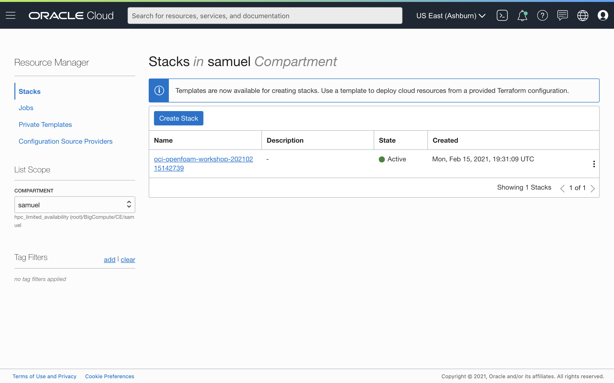
	

	

	5.2. On the <b>Stack Details</b> page, Under <b>Terraform Actions</b> dropdown menu, click <b>Destroy</b> > <b>Destroy</b> to deprovision the infrastructure.
	

		
Deprovision the infrastructure

	
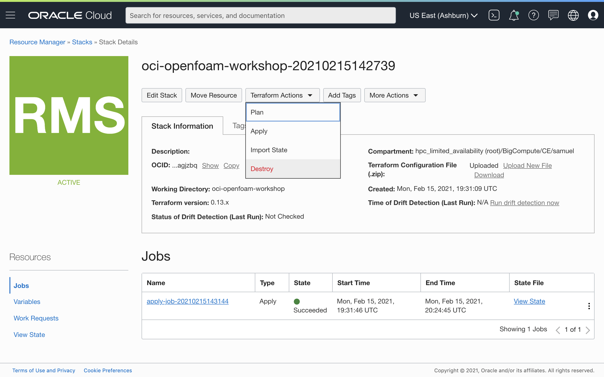
	

	

	
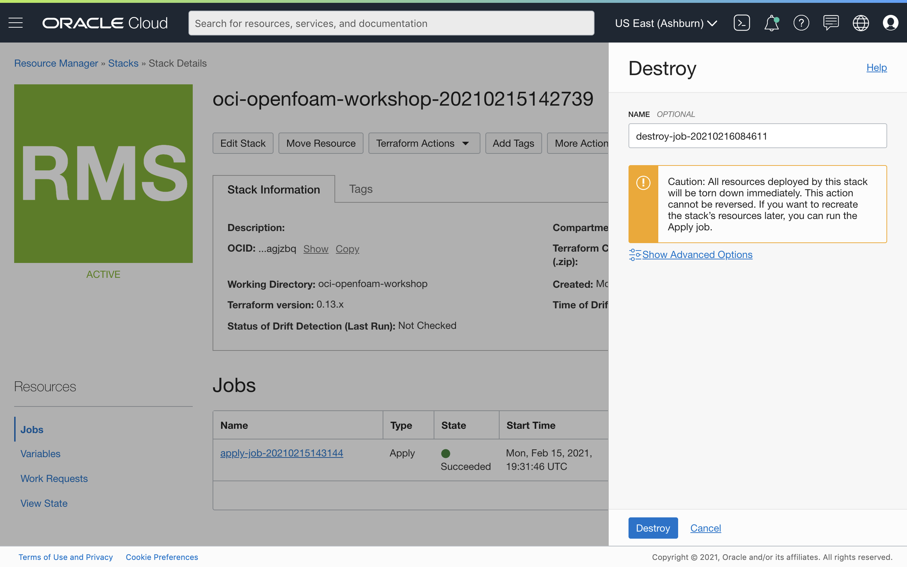

	

	

		
Resource Manager - <b>Destroy</b> job in progress

	
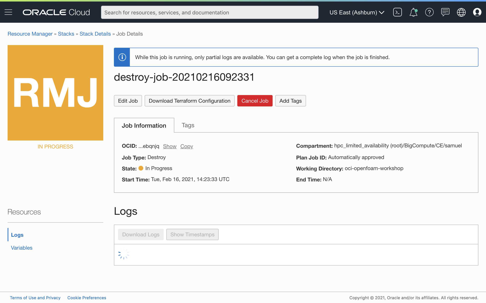
	

	

	

		
Resource Manager - <b>Destroy</b> job complete

	

	

	

