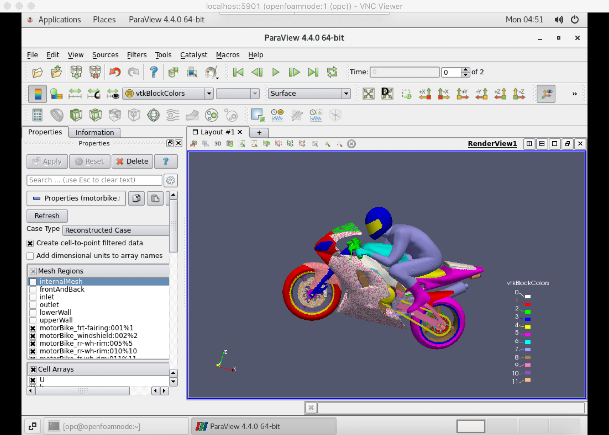

# oci-openfoam-workshop

### Motorbike Simulation on Oracle Cloud Infrastructure (OCI)

	

### Workshop Prerequisites
- Access to an OCI Tenancy (account)
- [VNC Viewer](https://www.realvnc.com/en/connect/download/viewer/) installed on your local machine as a client application for VNCServer.
- An SSH Key Pair on your local machine.
- Permissions to manage the following resources in some Compartment: Virtual Cloud Network, Subnet, Route Table, Security List, Internet Gateway, Compute Instance, Block Volume. (See [Identity and Access Management Policies](https://docs.oracle.com/en-us/iaas/data-safe/doc/iam-policies.html))
- Sufficient availability to provision 1 x each of the aformentioned resources. You can check resource availability:
<pre>
Hamburger Menu &gt Identity &gt Governance &gt Limits, Quotas and Usage
</pre>

### Workshop Steps
###### 
Total Time: 1-2 hours

1. Launch a job via Resource Manager that provisions the infrastructure on OCI by deploying the <b>openfoam-workshop</b> project.\
	:clock3:
	&nbsp;
	~10 minutes
	

	1.1. Clone this project:
	

	<pre>
	git clone https://github.com/scacela/oci-openfoam-workshop
	</pre>
	1.2. Open a web browser and navigate to the <b>Create Stack</b> wizard in Resource Manager, in your Compartment:
	

	<pre>
	cloud.oracle.com &gt sign into your OCI Tenancy &gt click Hamburger Menu &gt hover over <b>Resource Manager</b> &gt click <b>Stacks</b> &gt choose your Compartment from the dropdown menu under <b>List Scope</b> &gt click <b>Create Stack</b>
	</pre>
	1.3. In the <b>Stack Information</b> section of the <b>Create Stack</b> wizard, click <b>Browse</b> under <b>Stack Configuration</b> and choose the <b>openfoam-workshop</b> folder (or .zip file), then click <b>Next</b>.
	

	1.4. In the <b>Configure Variables</b> section, do the following for the appropriate field:
	- Select a Compartment where you have permissions to manage the resources that are mentioned in the [Prerequisites](#workshop-prerequisites) section.
	- Paste the contents of your SSH Public Key file.
	

	The default location of your SSH Public key file on your machine is <b>~/.ssh/id_rsa.pub</b>. You can copy these contents to your clipboard from your Mac OS local machine by executing:
		

	<pre>
	pbcopy &lt ~/.ssh/id_rsa.pub
	# pbcopy &lt <b>PUBLIC_KEY_PATH</b>
	# then paste with CMD+V
	</pre>
	
or

	<pre>
	cat ~/.ssh/id_rsa.pub
	# cat <b>PUBLIC_KEY_PATH</b>
	# capture the output manually with CMD+C, then paste with CMD+V
	</pre>
		
You can generate a new key pair on Mac OS if necessary by executing:

	<pre>
	ssh-keygen
	</pre>
		on your Mac OS or Linux machine and choosing the default options.
	- Select a shape for your Compute Instance.
	

	The name of the shape indicates the number of cores that are available to that shape, e.g. VM.Standard2.<b>8</b> has <b>8</b> cores available.
	- Select the number representing the Availability Domain (AD) in which the infrastructure will be provisioned.
	

	Note that the availability of cores the shape that you use will vary between Availability Domains. The way to check Resource Availability is described in the [Prerequisites](#workshop-prerequisites) section.
	

	1.5. In the <b>Review</b> section, click <b>Create</b>.
	

	1.6. On the <b>Stack Details</b> page, Under <b>Terraform Actions</b> dropdown menu, click <b>Apply</b> > <b>Apply</b>.
2. Wait for the infrastructure to finish provisioning. You can monitor the logs on the left side of the page, where output information will appear when the Resource Manager job finishes.\
	:clock3:
	&nbsp;
	~45 minutes with BM.Standard2.52 shape\
	:clock3:
	&nbsp;
	~60 minutes with VM.Standard2.16 shape\
	:clock3:
	&nbsp;
	~75 minutes with VM.Standard2.8 shape
	

3.	Connect to your remote host via VNC.\
	:clock3:
	&nbsp;
	~5 minutes
	

	3.1. Establish a port mapping from port 5901 on your local machine to port 5901 on the remote host. You can find the public IP address of your remote host from the Outputs section on the left side of the screen after the Resource Manager job has completed.
	

	
Resource Manager Outputs

	

	

	

	<pre>
	# if private ssh key is in default location, ~/.ssh/id_rsa
	ssh -L 5901:localhost:5901 opc@<b>REMOTE_HOST_IP_ADDRESS</b>
	&nbsp;
	# if private ssh key is in a different location, execute this command:
	ssh -i <b>SSH_PRIVATE_KEY_PATH</b> -L 5901:localhost:5901 opc@<b>REMOTE_HOST_IP_ADDRESS</b>
	</pre>
	

	3.2. Execute the following command on your remote machine to launch a VNCServer instance on port 5901 on the remote host:
	

	<pre>
	vncserver
	</pre>
	

	3.2. On your local machine, open VNC Viewer.
	3.3. Enter <b>localhost:5901</b> into the searchbar and press return.\
	3.4. Enter the password <b>HPC_oci1</b> when prompted.\
	3.5. Click through the default options \(<b>Next</b>, <b>Skip</b>\) to get to the end with the VNC setup wizard:
	

	<pre>
	language options &gt keyboard layout options &gt location services options &gt connect online accounts options
	</pre>
	

4.	Visualize the Motorbike simulation using ParaView.\
	:clock3:
	&nbsp;
	~5 minutes
	

	4.1. Open Terminal from your VNC Viewer window:
	

	<pre>
	click Applications &gt hover over System Utilities &gt click Terminal
	</pre>
	

	4.2. Open Paraview by executing the following command from the Terminal instance in your VNC Viewer window:
	

	<pre>
	paraview
	</pre>
	

	4.3. In ParaView, open the motorbike.foam file:
	

	<pre>
	click File > Open > choose /mnt/volb/work/motorbike.foam
	</pre>
	

	4.4. Under the <b>Properties</b> pane on the left side of Paraview, select <b>Mesh Regions</b> to select everything, and then deselect the options that do not start with the string <b>motorBike_</b>. You can adjust the windows to make this section of the GUI easier to access e.g. by closing <b>PipeLine Browser</b> section by clicking <b>X</b>.
	

	4.5. Click the green <b>Apply</b> button to render the motorbike image. If a window with a list of errors appears, titled <b>Output Messages</b>, you may close it.
	

	4.6. Use your mouse and its left-click button to manipulate the virtual motorbike that appears.
